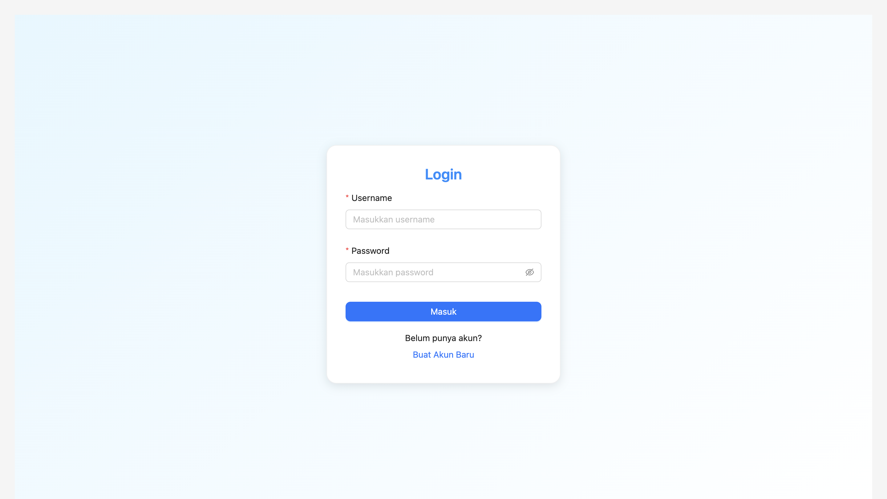
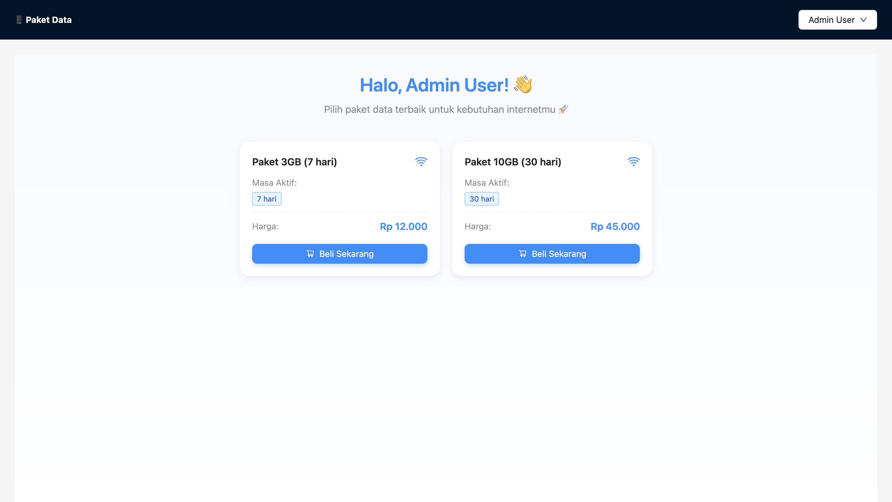
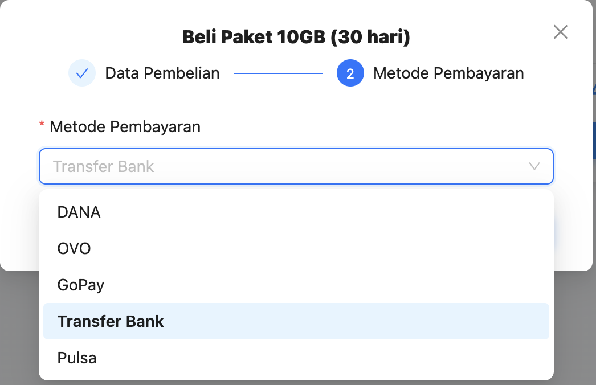
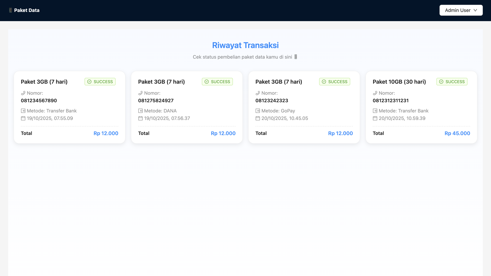
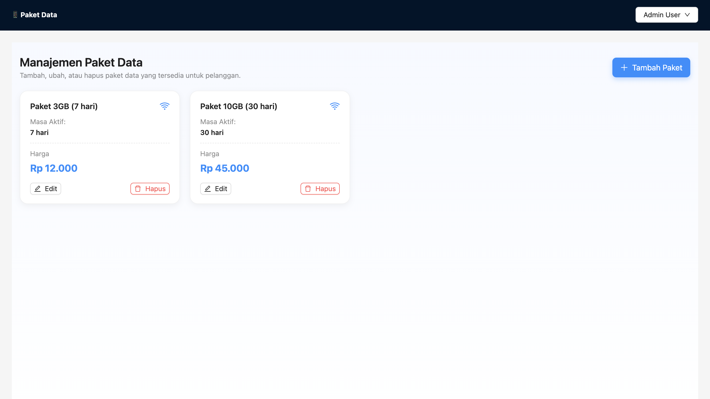

# Dokumentasi WEB

**Waktu Mulai Pengerjaan: 18 Oktober 2025**

**Waktu Penyelesaian: 20 Oktober 2025**

**WEB ini telah di deploy dan sudah dapat digunakan dengan cara mengakses link berikut:**

https://frontend-ecommerce-lac-xi.vercel.app/

**Halaman Login**

Dihalaman ini pengguna dapat login menggunakan akun:
- User Admin
User: admin
pass: 1234

- User Non-Admin
User: Budi
pass: password

Jika ingin mendaftar/membuat akun baru maka tekan "buat akun baru"

**Halamn Register**

Pengguna dapat membuat akun baru dengan menginputkan nama, user dan password. Jika sudah mendaftar maka tekan "Masuk di sini"

**Halaman Dashboard**

Dihalaman ini berisikan paket data yang tersedia dan dapat di beli oleh pengguna.

**Cara Pembelian**

Tekan "Beli Sekarang" lalu masukkan nomor dengan format harus diawali 08xxxxx dan terdiri 8-13 angka

Setelah itu tekan lanjutkan Pembayaran dan akan masuk ke pemilihan metode pembayaran

Pilih metode pembayaran yang tersedia dengan menekan menu dropdown

# Riwayat Transaksi

Di halaman ini berisikan paket paket yang telah dibeli oleh pengguna

# Manajemen Paket (Admin)

Halaman ini hanya dapat di akses oleh Admin, dan di halaman ini admin dapat melakukan modifikasi, menambah, hingga menghapus sebuah paket (CRUD)

Admin dapat menambahkan paket baru dengan cara menekan tombol "tambah Paket"

Admin juga dapat mengedit data yang sudah ada dengan cara menekan tombol edit

